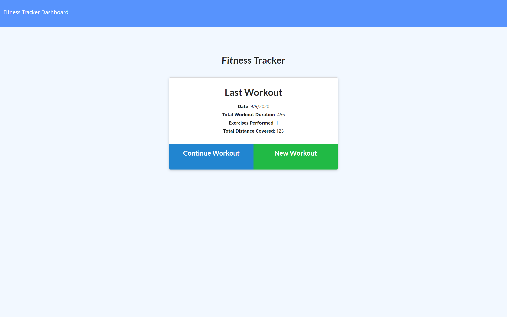
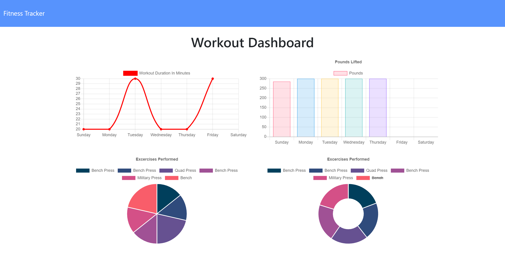

# Workout-Tracker

## Link to repository: 

**Github:** https://github.com/KeithBillings/Workout-Tracker 


## Description: 

This app records a user's workout and aggrigates it to a graph that displays all the different workout data in relation to each other.
    
## Table of Contents: 

* [Installation](#installation)
* [Usage](#usage)
* [Technologies Used](#technologies-used)
* [License](#license)
* [Tests](#tests)
* [Screenshots](#Screenshots)
* [Author](#author)
* [Questions](#questions)

    
## Installation: 

To use this app on your local computer 

* Clone the repo

* Run the command ``` npm i ``` to install dependancies 

* Seed the project with the command ``` npm run seed ``` 

* To run the server ``` npm start ``` 
    
## Usage: 
    
To keep track of a user's workouts

## Technologies Used: 
    
Technologies used in this application: Javascript, MongoDB, Node, Express, AJAX, HTML, and CSS

    
## License: 
    
MIT     

## Tests: 

No tests.

## Screenshots: 





## Author

Keith Billings
    
## Questions: 
    
If you have any questions about this project or would like to collaborrate with the authors, please reach out to anyone on the team. We look forward to working with you!

- [Keith Billings](https://github.com/KeithBillings) @ keithbillingsbusiness@gmail.com